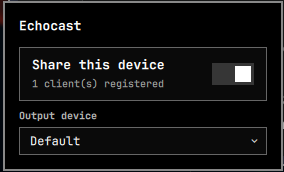
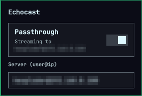

<div align="center">


# Echocast

**🔊 your voice, heard somewhere else 🔊**

[](LICENSE)
[](https://omarchy.org)
[](echocast)

</div>

Hear one machine's sound out of another machine's speakers, over SSH,
automatically falling back to local playback the moment that's not possible.

In Greek myth, Echo was a nymph who lost her own voice and was left able
only to repeat, elsewhere, whatever she'd just heard. That's the whole
plugin: your **client** machine's audio doesn't play where it's made — it
plays wherever your **server** machine is listening, for as long as that's
reachable, and falls back to playing locally the instant it isn't.

Built for the case where a laptop generates notification sounds all day but
the good speakers are attached to a desktop across the room: dock the
laptop, its sound comes out of the desktop; unplug it and walk away, it
plays through its own speakers again, with no manual switching.

## ⚙️ How it works

Two roles, same install, one on each machine:

- 🖥️ **Server** — the machine with the speakers. Has no daemon of its own:
  `sshd` *is* the server. Each accepted client gets a dedicated,
  command-restricted SSH key (the same trick GitHub deploy keys use) that
  can do exactly one thing — play whatever PCM audio arrives on that
  connection to the server's chosen output device. The bar widget's on/off
  switch and device picker just flip a config file that connection reads.
- 💻 **Client** — the machine generating the sound. A small systemd user
  service keeps a null audio sink as the default output and streams its
  monitor to the server over SSH. The moment that connection can't be kept
  alive for any reason — passthrough switched off, the server unreachable
  or switched off, this client no longer accepted — it puts the real
  output device back and keeps quietly retrying in the background.

Audio travels as raw PCM straight through the SSH channel itself: no extra
port, no extra encryption layer, nothing to open on your firewall beyond
SSH already being reachable on the server. Both ends hold a **200ms jitter
buffer** by default (tunable with `echocast set-buffer-ms <ms>`, either
side) — enough to absorb the odd network stall as silence you'd never
notice instead of an audible click, at the cost of that much fixed delay.
That's built for notification sound and for a video's audio playing out of
another room's speakers (a training video in a browser tab, say) — fine
places to trade a fraction of a second of lag for it never stuttering.
It's not aimed at anything needing frame-accurate lip-sync or pro-audio
latency. Multiple clients can stream to the same server at once — PipeWire
mixes whatever lands on the chosen output device, same as any other two
apps playing sound on it.

Each client has its own dedicated keypair, generated on first run and
registered on the server by hand (`echocast add-client <name> <pubkey>`) —
nothing here piggybacks on your personal SSH setup, and adding a third
machine later is the same two steps again, independent of the first.

## 📦 Install

```bash
curl -fsSL https://raw.githubusercontent.com/hexploder/echocast/main/install.sh | bash
```

Run it on **both** machines. It installs the `echocast` CLI, installs the
Omarchy bar widget if it finds `~/.config/omarchy`, and then walks you
through the rest interactively: which role this machine plays, the
server's address, and (on the client) printing the public key you paste
into the server's `add-client` command.

Prefer to read the script first, or do it by hand? See
[Manual install](#manual-install) below — `install.sh` is just this in one
guided pass with prompts.

### Adding the bar widget without the installer

If you've already run `install.sh` on a non-Omarchy box and later move the
CLI's config to an Omarchy machine, or you'd rather manage the bar layout
yourself:

```bash
git clone https://github.com/hexploder/echocast.git /tmp/echocast
mkdir -p ~/.config/omarchy/plugins/io.github.hexploder.echocast
cp /tmp/echocast/{manifest.json,Service.qml,BarWidget.qml,Panel.qml} \
   ~/.config/omarchy/plugins/io.github.hexploder.echocast/
```

Then add `{"id": "io.github.hexploder.echocast"}` to a section of
`bar.layout` in `~/.config/omarchy/shell.json`, and run
`omarchy-restart-shell`. (**Don't** run `omarchy-refresh-shell` — that one
resets `shell.json` to Omarchy's defaults, wiping your whole bar layout.)

If the widget's icon shows a small hint that the backend isn't installed
yet, that's exactly the case this section covers — the popup shows the
`install.sh` one-liner directly so there's nothing to look up.

## 🎛️ Using it

Click the bar icon. The first time, it asks which role this machine plays.

- **Server**: an on/off switch and a dropdown of every real output device
  currently available (via PipeWire), including "Default" — pick a
  specific device if this machine's default output isn't the one you want
  clients to reach.
- **Client**: an on/off switch and a `user@host` field for the server.

<div align="center">

&nbsp;&nbsp;&nbsp;


<sub>Server (left) · Client (right)</sub>
</div>

Everything the widget does, the CLI does too — useful for scripting, or if
you'd rather not click:

```bash
echocast status                          # current role/state as JSON
echocast set-role <server|client>
echocast client-set-server <user@host> [port]
echocast client-set-enabled <true|false>
echocast server-set-enabled <true|false>
echocast server-set-device <name|default> # pactl/wpctl sink name
echocast add-client <name> <pubkey>       # run on the server
echocast remove-client <name>             # run on the server
echocast set-buffer-ms <ms>               # jitter buffer, either side (default 200)
```

## 🛠️ Manual install

Server machine:

```bash
mkdir -p ~/.local/bin
cp echocast ~/.local/bin/echocast && chmod +x ~/.local/bin/echocast
echocast set-role server
echocast server-set-enabled false
echocast server-set-device default
```

Client machine:

```bash
mkdir -p ~/.local/bin ~/.config/systemd/user
cp echocast ~/.local/bin/echocast && chmod +x ~/.local/bin/echocast
cp echocast-client.service ~/.config/systemd/user/
echocast set-role client
echocast client-set-server user@your-server-ip
echocast client-set-enabled false
systemctl --user daemon-reload
systemctl --user enable --now echocast-client.service
echocast init-keys   # prints this client's public key
```

Copy the printed public key to the server and run there:

```bash
echocast add-client <a-name-for-this-client> "<pubkey>"
```

Then turn it on from either side's bar widget, or:

```bash
echocast client-set-enabled true   # on the client
```

## ➕ Adding a third machine later

Same client install on the new machine, pointed at the server's address,
then one `add-client <name> <pubkey>` on the server. Nothing about the
existing clients changes — the server's device selection and the other
clients' settings are all independent of each other.

## 🔧 Troubleshooting

- **Nothing plays on the server**: run `echocast status` on both sides.
  `state: "local"` on the client for more than a few seconds while enabled
  means the connection isn't establishing — check
  `server-set-enabled true` on the server, that the client's public key is
  in the server's `~/.ssh/authorized_keys` with an `# echocast:<name>`
  comment, and that `ssh -i ~/.config/echocast/id_ed25519 user@host` from
  the client doesn't prompt for anything (it should just hang — that's
  correct, the forced command is a media pipe, not a shell; Ctrl-C out of
  it once you've confirmed it connects).
- **Wrong/no device on the server**: `echocast server-set-device` takes a
  `pactl list sinks short` name, or `default`. A device that's
  disconnected won't take over playback until it's back and re-selected.
- **The bar icon says the backend isn't installed**: run the one-liner it
  shows you, then reopen the panel — no reload needed, it re-checks on
  every open.
- **Audio clicks/drops out over Wi-Fi or a busy network**: raise the
  buffer — `echocast set-buffer-ms 400` (or higher) on either machine,
  takes effect on the next connection attempt, no restart needed. Going
  the other way (lower than 200) trades that margin back for less delay,
  at the risk of the clicks coming back on anything less than a clean LAN.

## 🤔 Why SSH instead of a dedicated audio protocol

Because it's already there, already encrypted, and already exactly as
reachable as the server machine itself — no new port, no new trust store,
no separate service to keep patched. The tradeoff is latency, not
reliability: the 200ms default buffer (see above) makes it solid for
notification and desktop/video sound, but it's not chasing the
sub-20ms, sample-accurate sync that music production or gaming need — for
that, look at something built for it, like Snapcast or a PipeWire RTP
module.

## 📜 License

MIT — see [LICENSE](LICENSE).
